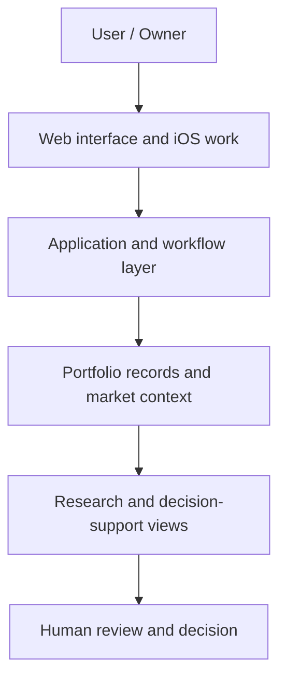

# Wealthya

**AI-assisted Wealth Management / Asset Intelligence Platform**

A local-first web and mobile product developed through AI-assisted software development to organize financial information, support portfolio monitoring, and improve human decision workflows.

> **In one minute:** I framed a real owner problem, translated it into product workflows, coordinated AI-assisted implementation, and reviewed the resulting software. Wealthya supports human decisions; it does not place trades.

## What I Built

Wealthya (also developed under the OwnerOS name) is a working, evolving asset intelligence product. Its web application brings portfolio information, market context, and research into a decision-support workflow. The private project also includes iOS work. This public repository is a case study, not a runnable copy of the application.

## Problem

An owner needs a coherent view of different assets and the context behind them. Scattered records and market information make it harder to review a portfolio, spot questions that need attention, and make a considered decision. The product turns that fragmented workflow into a structured review process.

## My Role

I led problem framing, product requirements, workflow and system design, prioritization, and product decisions. I translated business requirements into expected software behavior; coordinated AI-assisted implementation; reviewed outputs; and drove testing and iteration. I do not claim to have written every line of code or to be a traditional software engineer.

## Product / Workflow

1. Organize portfolio records and their context.
2. Review portfolio and market information together.
3. Investigate signals or questions that need more evidence.
4. Keep the human owner responsible for interpretation and action.

The [synthetic example](sample-data/portfolio.example.json) illustrates the *shape* of a portfolio record. It does not represent a real account, holding, balance, or user.

## System Architecture

This is a public-safe conceptual view, not a deployment or security diagram. [Architecture notes](docs/architecture.md) explain the boundaries.

## AI-Assisted Development Process

**Problem → specification → AI-assisted implementation → human review → tests → iteration.** AI accelerates execution; human judgment owns requirements, product tradeoffs, and validation. See the [development process](docs/development-process.md).

## Technology

Verified in the private project: **Next.js, React, TypeScript, Drizzle ORM, and a Cloudflare/vinext web stack**. The project includes iOS work. These are technical exposures, not a claim that every component is complete or publicly deployed.

## Product & Systems Thinking

The important design choice is the full workflow: data enters a portfolio view, context helps a person investigate, and the decision remains with that person. I separate owner-provided records, market context, and research so that missing or uncertain inputs are visible instead of silently treated as facts. I prioritize privacy and reviewability as product requirements.

## Privacy / Safety by Design

The product is local-first and decision-support only. This public edition contains no private source or real financial records. The separation lets reviewers understand the problem, design, process, and technical scope without exposing users or operations. See [privacy and safety](docs/privacy-and-safety.md).

## What This Demonstrates

- Turning a real business problem into a working technology product.
- Product and systems thinking across data, workflow, and human decisions.
- Practical use of AI tools for building and iterating, beyond prompting alone.
- Fast learning across unfamiliar technical domains.
- Collaboration with AI and technical specialists, with disciplined human review.
- A contribution style suited to AI Business & Product and AI Applications team projects.

## Screenshots / Demo

No product screenshot or live demo is published here because a capture free of private data has not been verified. The [short case study](docs/portfolio-summary.md), [architecture](docs/architecture.md), and [synthetic sample](sample-data/portfolio.example.json) are available for immediate review.

> **Public portfolio edition:** production and private source are intentionally excluded.
