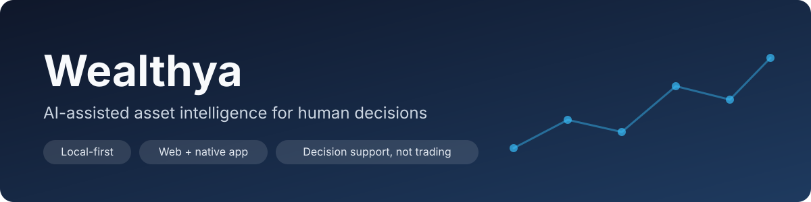
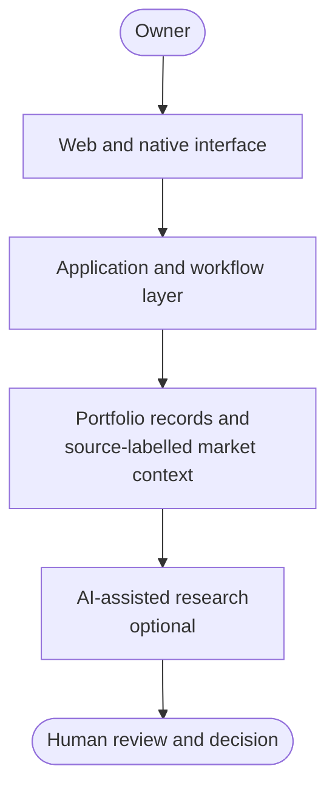
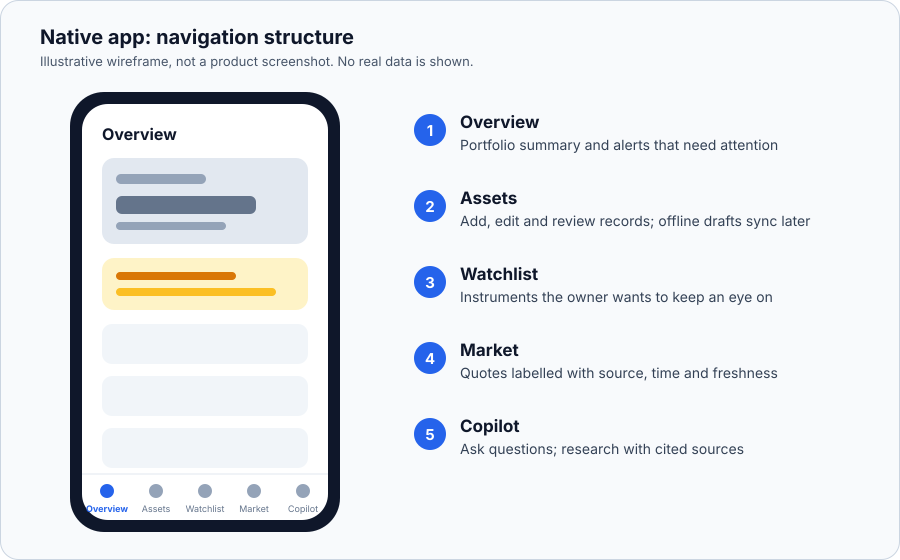

<p align="center">
  
</p>

# Wealthya

**AI-assisted Wealth Management / Asset Intelligence Platform**

A local-first web and mobile product developed through AI-assisted software development to organize financial information, support portfolio monitoring, and improve human decision workflows.

[Tiếng Việt](README.vi.md) · [Two-minute case study](docs/portfolio-summary.md) · [Product tour](docs/product-tour.md) · [Product decisions](docs/product-decisions.md) · [Architecture](docs/architecture.md) · [Status and roadmap](docs/status-and-roadmap.md)

> **In one minute:** I framed a real owner problem, translated it into product workflows, directed AI-assisted implementation, and reviewed the resulting software. Wealthya supports human decisions; it does not place trades.

## At a glance

| | |
|---|---|
| **Problem** | Portfolio records, market context and open questions live in different places, so every decision starts with rebuilding the picture. |
| **What I built** | A web app and PWA, a native SwiftUI app for iPhone and Mac, and a tenant-scoped API behind them. |
| **My role** | Product owner and system designer. AI tools did the implementation under my specification and review. |
| **Hard boundary** | Decision support only. There is no trading or order capability. |
| **Stage** | Private and pre-launch. No public users, revenue or performance claims. |
| **In this repository** | Case study, product decisions, architecture, honest status, and synthetic sample data. |

**Short on time?** Read this page, then [Product decisions](docs/product-decisions.md) for the judgment behind the product, and [Status and roadmap](docs/status-and-roadmap.md) for what is and is not finished.

## What I Built

Wealthya, developed under the name OwnerOS in the app, brings a household's assets, market context and research into one decision-support workflow.

- **Web app and PWA** with a private owner profile, and a separate commercial workspace that starts from an empty state with guided onboarding.
- **Native SwiftUI app** for iPhone and Mac with five tabs: Overview, Assets, Watchlist, Market and Copilot.
- **Versioned, tenant-scoped API** with an append-only audit trail, data export and account deletion.
- **Deterministic financial core** with exact money handling and automated tests.
- **Source-labelled market context** and an **optional AI Copilot** with per-asset research that cites its sources.

This repository is a public case study, not a runnable copy of the application.

## Problem

An owner needs a coherent view of different assets and the context behind them. Scattered records and unsourced market numbers make it harder to review a portfolio, notice what needs attention, and make a considered decision. The product turns that fragmented routine into a structured review process.

## My Role

I led:

- problem framing and product requirements;
- workflow and system design;
- translating business requirements into software behaviour;
- directing AI-assisted implementation and reviewing what it produced;
- testing, iteration, and prioritization and product decisions.

I do not claim to have written every line of code, and I do not present myself as a traditional software engineer. The value I bring is turning a real business problem into working software with disciplined use of AI.

## Product / Workflow

Record the portfolio, add context, surface exceptions, investigate with sources, then let the owner decide and note the outcome. See the [product tour](docs/product-tour.md) for the five screens.

Two synthetic files show the shape of the data: a [portfolio example](sample-data/portfolio.example.json) and a [source-labelled quote example](sample-data/market-quote.example.json). Both are **synthetic sample data**. They do not represent any real account, holding, balance or user.

## System Architecture



A public-safe conceptual view. [Architecture notes](docs/architecture.md) explain the design rules and what is deliberately left out.

## AI-Assisted Development Process

**Problem → specification → AI-assisted implementation → human review → tests → iteration.** AI accelerates execution. Human judgment owns requirements, product trade-offs and validation. Details are in the [development process](docs/development-process.md).

## Technology

Verified in the private project. These are areas of exposure, not a claim that every component is finished or publicly deployed.

| Layer | Used |
|---|---|
| Web | Next.js, React, TypeScript, PWA |
| Data | Drizzle ORM, Cloudflare D1, vinext build stack |
| Native | Swift, SwiftUI (iPhone and macOS) |
| Quality | Swift package tests, web contract and rendering tests, GitHub Actions workflow |
| AI | AI coding tools for development; an optional language-model API for research and Copilot |

## Product & Systems Thinking

The important design choice is the full workflow: data enters a portfolio view, context helps a person investigate, and the decision stays with that person. Four choices carry most of the weight:

- **Never act, only inform.** No trading capability, by design.
- **Deterministic numbers, AI at the edge.** Canonical figures come from tested code, not a model.
- **Every number has a source.** Provider, observed time and freshness are shown.
- **Gate the launch.** Authentication, isolation, deletion and licensing must pass before release.

The reasoning and trade-offs for eight such decisions are in [Product decisions](docs/product-decisions.md).

## Quality and Safety Signals

- Exact money arithmetic in minor units, with mixed currencies rejected rather than guessed at.
- Automated tests for the financial core, plus web contract and rendering tests run by a CI workflow.
- Physical-device journeys are kept as a manual gate and are not counted as an automated pass.
- Git safety and CI guardrails protect the private repository.
- Secrets never live in source, and private runtime data stays out of any release build.
- The AI Copilot degrades to a local mode instead of failing when the AI service is unavailable.

## Privacy / Safety by Design

The product is local-first and decision-support only. This public edition contains no private source, no production configuration and no real financial records. Keeping them out is a deliberate engineering decision: reviewers can judge the problem, design, process and technical scope without exposing users or operations. See [privacy and safety](docs/privacy-and-safety.md).

## What This Demonstrates

- Turning a real business problem into a working technology product.
- Product and systems thinking across data, workflow and human decisions.
- Practical use of modern AI tools to build and iterate, beyond prompting alone.
- Fast learning across unfamiliar technical domains: web, native, data and API design.
- Disciplined human review of generated output instead of blind acceptance.
- Honest scoping: naming what is unfinished and what the product refuses to do.
- A contribution style suited to AI Business & Product and AI Applications team projects.

## Screenshots / Demo

No product screenshot or live demo is published, because a capture free of private data has not been verified. The wireframe below shows the structure of the native app. It is labelled as a wireframe and is not a screenshot.



## Repository map

```text
README.md                  This page
README.vi.md               Vietnamese summary
docs/portfolio-summary.md  Two-minute case study
docs/product-tour.md       The five screens and the review loop
docs/product-decisions.md  Eight product decisions and their trade-offs
docs/architecture.md       Conceptual architecture and design rules
docs/development-process.md  How AI-assisted development was run
docs/status-and-roadmap.md   What is built, what is not, what is next
docs/privacy-and-safety.md   Why private source is excluded
sample-data/               Synthetic examples only
assets/                    Banner and labelled wireframe
```

*Public portfolio edition: production and private source are intentionally excluded.*
