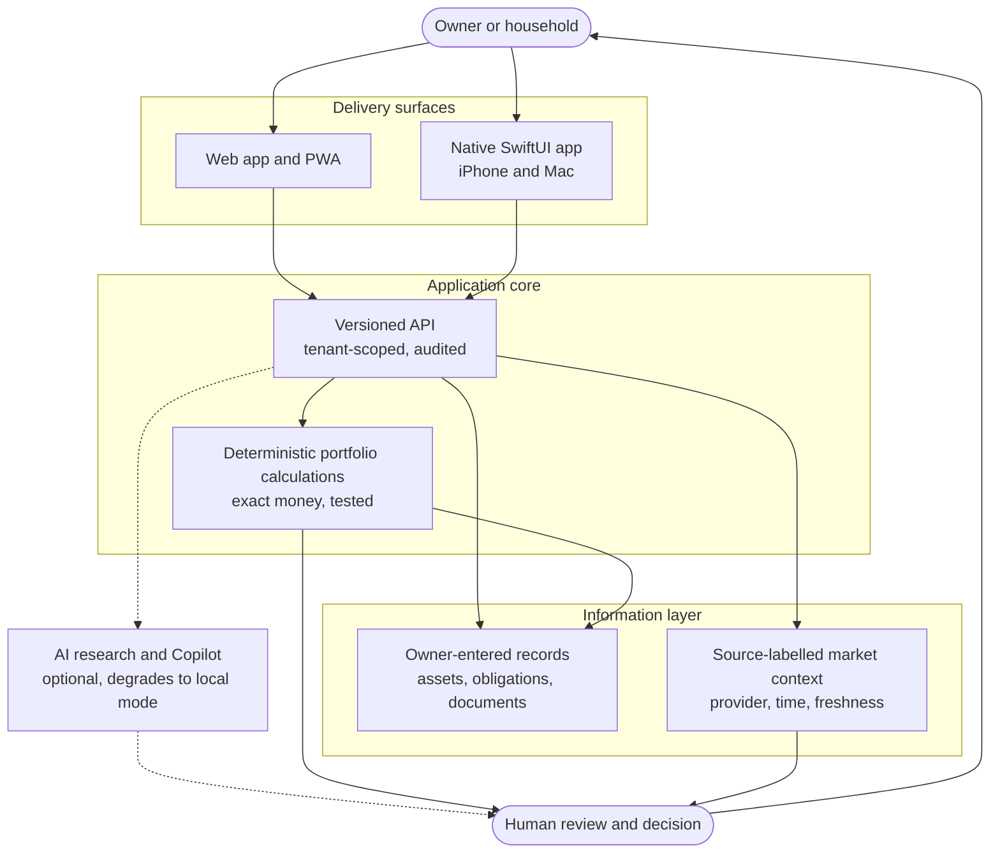

# Architecture

A conceptual, public-safe model of the product. It explains the shape of the system and the reasoning behind it. It does not describe private deployment, authentication or security internals, which are intentionally left out of this edition.

## The system in one picture

Solid arrows are the dependable path. Dotted arrows are optional assistance: if the AI service is unavailable, the rest of the system still works.

## Design rules behind the diagram

1. **One core, several surfaces.** The web app and the native app both consume the same versioned API, so business rules live in one place.
2. **Deterministic core, probabilistic edge.** Anything that produces a canonical number is ordinary tested code. AI sits at the edge, where it can suggest and explain but cannot silently change the record.
3. **Server is authoritative.** Clients create drafts, and the server accepts, rejects or reconciles them. This keeps two devices from corrupting the same record.
4. **Tenant isolation by design.** The data model separates portfolios by tenant and records audit events. It is designed so that one user's data is not exposed to another user's session; this is a design goal, not an audited security claim.
5. **Provenance travels with data.** Market inputs carry provider, observed time, staleness and licence scope through to the screen.
6. **The human is the last step.** There is no execution path from the system to a market. Decisions happen outside the app.

## Data model, in words

The private codebase defines a schema for tenants, portfolios, assets, user settings and append-only audit events. Money is handled as integer minor units with an explicit currency, which avoids floating-point drift and makes mixed-currency mistakes impossible to hide.

## What is intentionally not shown

Deployment topology, authentication flow details, network layout, secrets handling and provider integrations. Publishing them would add risk without helping an admissions review. See [privacy and safety](privacy-and-safety.md).

Related reading: [product decisions](product-decisions.md), [product tour](product-tour.md), [status and roadmap](status-and-roadmap.md).
