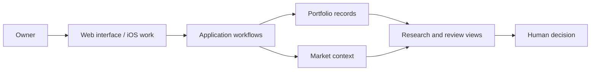

# Architecture

This is a conceptual, public-safe model of the product workflow. It does not describe private deployment, authentication, or security internals.

The web product combines owner-entered portfolio information with relevant context for review. The private codebase includes a data schema for portfolios, tenancy, and audit events, plus iOS work. This diagram deliberately omits implementation and operating details that are unnecessary for an admissions review.

The human remains the decision maker. Wealthya supports monitoring and research; it does not place orders or execute transactions.
