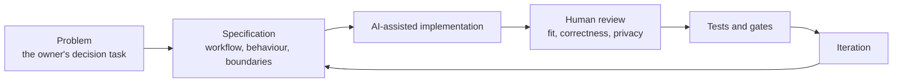

# Development process

AI is an execution accelerator. Human judgment stays responsible for the problem, the priorities, the acceptance criteria and the validation. A generated output is a candidate until it has been reviewed.

## The loop

1. **Problem.** Identify the owner's decision task and where information is fragmented.
2. **Specification.** Define the workflow, the required behaviour, the data boundaries and the review criteria before any code is generated. The private project keeps written architecture, product and governance documents alongside the code, including milestone controls and launch gates.
3. **AI-assisted implementation.** Use AI coding tools to accelerate code and interface work against that specification.
4. **Review.** Inspect the output for product fit, correctness, privacy and unsupported assumptions. Anything that cannot be justified is sent back.
5. **Tests and gates.** Run automated checks, then apply the gates that automation cannot cover. Financial calculations have their own tests, the web app has contract and rendering tests, and a CI workflow runs them. Journeys on a physical iPhone stay a manual gate and are never counted as an automated pass.
6. **Iteration.** Revise the specification and the implementation when review or tests expose gaps.

## Who does what

| Human | AI tools |
|---|---|
| Defines the problem and the users' decisions | Drafts code and interface work from the specification |
| Sets priorities and decides what not to build | Iterates quickly on review feedback |
| Writes acceptance criteria and launch gates | Handles repetitive implementation work |
| Reviews every result and accepts or rejects it | Proposes options for the human to judge |
| Owns privacy, safety and product boundaries | Does not decide scope, risk or release |

## Guardrails that make AI-assisted work safer

- Secrets are passed through the environment and never written into source.
- Private runtime data lives outside the code that could be published or built for release.
- Git safety and CI checks were added to the private repository to catch mistakes before they spread.
- Every launch-blocking gap is written down, so nothing ships by omission. See [status and roadmap](status-and-roadmap.md).

## Provenance, stated plainly

In the private repository most commits are authored by an AI coding agent working from my specifications. That is the intended model: I direct and review, the agent implements. It is also why this showcase claims product and systems ownership, and does not claim that I wrote the code by hand.

Related reading: [product decisions](product-decisions.md), [architecture](architecture.md).
