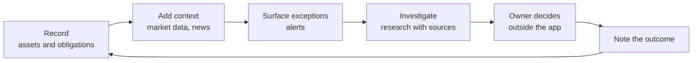

# Product tour

> What the product does, screen by screen. This is a written tour: the public edition contains no product screenshots (see [assets](../assets/README.md) for why). The wireframe below shows structure only.

## Who it is for

Individuals and households, and later family offices, who hold several kinds of assets (funds, property, cash and others) and want one private place to keep records and think through decisions.

The product promise, in one line: **private asset intelligence and evidence-backed recordkeeping.** Wealthya does not execute trades, guarantee returns, file taxes, sign contracts, or replace licensed legal, tax, valuation or investment professionals.

## The review loop

The loop is deliberately built around exceptions: the owner should start from what changed or looks unusual, not from a wall of numbers.

## The five surfaces

| Tab | Question it answers | Design choice |
|---|---|---|
| **Overview** | What changed, and what needs my attention? | Summary and alerts come first, so the owner starts with exceptions. |
| **Assets** | Is my record correct and complete? | Records can be added, edited and removed. Offline drafts are queued and synced; the server stays authoritative. |
| **Watchlist** | What am I keeping an eye on? | Instruments are tracked with the same source labelling as the Market tab. |
| **Market** | What is the context right now? | Every quote shows its provider, market state, observed time, staleness and licence scope. |
| **Copilot** | Help me think this through, with sources. | Chat plus per-asset research that collects cited web sources. If the AI service is unavailable, it falls back to a local mode instead of failing. |

Alerts appear inside Overview, Market and detail screens rather than in a sixth tab, which keeps navigation to five tabs on a phone.

## Design principles you can see in the tour

1. **Exceptions first.** Attention is the scarce resource, so alerts lead.
2. **Every number has a source.** Market context carries provenance and freshness, so stale data is visible rather than silently trusted.
3. **The human decides.** The app supports monitoring, research and recordkeeping. It has no trading or order capability.

## What the tour does not claim

No public release, users, revenue, or measured investment outcome. Billing and licensed market-data adapters are not built yet; see [status and roadmap](status-and-roadmap.md).
